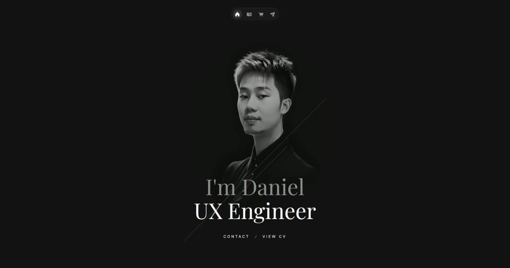

<div align="center">

<br />

<svg width="72" height="72" viewBox="0 0 52 52" fill="currentColor" xmlns="http://www.w3.org/2000/svg">
  <path d="M18.1984 39.0406H1.13537V19.7393C4.08733 25.3513 7.07174 30.9632 10.0561 36.5428H3.63319V28.6276C3.37367 28.1086 3.08172 27.622 2.82221 27.103C2.82221 30.5091 2.82221 33.9476 2.82221 37.3538H17.0954L22.0262 28.0762L21.572 27.2003L16.6088 36.5428H13.9164L0.908296 12.1161H0L12.9757 36.5428H10.9644L0.324392 16.4954V39.884H18.685L23.486 30.8659C23.3238 30.574 23.194 30.282 23.0318 29.9901L18.1984 39.0406Z" />
  <path d="M46.1934 12.1161L33.8665 35.2776C32.7636 33.1042 27.184 22.3344 25.3999 19.3825C25.2701 19.1878 25.0431 18.7661 24.6538 18.2795C23.2265 16.3656 21.5721 15.2627 20.8584 14.841C20.1123 14.4193 18.8147 13.738 17.063 13.3488C15.8952 13.0893 14.8896 13.0244 14.1435 13.0244H4.31444C7.94763 19.869 11.5808 26.6813 15.214 33.5259C16.836 30.5091 18.4255 27.4598 20.0474 24.443L20.5016 25.3188C18.7499 28.5952 16.9657 31.904 15.214 35.2128L2.95199 12.181H14.1435C15.3762 12.181 18.2633 12.3432 21.2801 14.1598C24.297 15.9763 25.8216 18.4093 26.4055 19.5122C28.8709 24.1835 31.3687 28.8547 33.8341 33.5259L45.2202 12.1161H46.1934Z" />
  <path d="M49.1453 12.1161L35.7155 37.3538H32.1147L24.232 22.6264L22.7074 19.9339C21.7342 18.5715 20.4366 17.4685 18.9444 16.7224C17.4847 15.9763 15.8303 15.5546 14.1434 15.5546H7.85024L7.42854 14.7112H14.1434C15.1491 14.7112 17.1278 14.841 19.3013 15.9763C21.5071 17.1117 22.7723 18.6688 23.3562 19.4798L24.9132 22.2047L32.5689 36.5428H35.1965L48.2046 12.1161H49.1453Z" />
  <path d="M52 12.1161L37.2402 39.8516H30.428L29.9738 39.0082C27.0543 33.5259 24.1348 28.0437 21.2152 22.5291C21.1828 22.4642 21.1504 22.3993 21.1179 22.3344V22.302C19.7879 19.7717 17.0955 18.1173 14.1435 18.1173H9.24519L8.79104 17.3064H14.1435C17.4847 17.3064 20.534 19.2203 21.9613 22.1722L30.9146 39.0406H36.7536L51.0593 12.1161H52Z" />
</svg>

<br />

# Zenfolio

### *Zen + Portfolio — a calm space where space speaks.*

Minimal distractions. Purposeful design. Quiet confidence.

**[danielwijaya.com](https://danielwijaya.com)**

<br />



<br />
<br />
<br />

<div align="center" style="display:flex;align-items:flex-start;height:auto;width:72px;border-bottom:1px solid currentColor;margin:0 auto;">
  <svg width="42" height="5" viewBox="0 0 42 5" fill="none" xmlns="http://www.w3.org/2000/svg" aria-hidden="true">
    <path d="M42 5H0L6.26866 0H35.7313L42 5Z" fill="currentColor" />
  </svg>
</div>

<br />
<br />

<div align="left">

## Stack


<br />

| | |
|---|---|
| **Framework** | Next.js 16 — App Router, SSG, API Routes, Turbopack |
| **Animation** | Framer Motion via `{ m }` + `LazyMotion` — optimized, tree-shaken bundle |
| **CMS** | Sanity Studio — GROQ queries, Portable Text, static generation |
| **Contact** | Zod validation · reCAPTCHA · IP rate limiting · Resend |
| **Dev Tools** | Storybook 10 · Vitest · Playwright |

<br />

## Features
- **Keyboard Navigation** — use hotkeys (Q / W / E / R / T) to switch pages and themes
- **Dark / Light theme** — HTTP-only cookie applied on server-side to avoid flickering
- **Moon / Sun transition** — transition between icons using [Flubber](https://github.com/veltman/flubber) (SVG morphing)
- **Loading screen** — preloads critical videos before first render
- **Framer Motion** — Framer Motion uses `{ m }` + `LazyMotion` with `domAnimation` bundle
- **`useTransform`** — maps motion values into smooth, responsive visual transitions
- **Interactive Header** — floating fixed navbar with fluid animation active indicator
- **Responsive Layout** — optimized spacing and typography that stay crisp at larger breakpoints (2K and 4K monitors)
- **Sanity CMS** — two content collections (`projects` and `products`) with drag-and-drop ordering, queried via GROQ at build time for zero-runtime CMS overhead
- **SEO** — Open Graph and Social Preview via a shared `generateSEO` component. Newly added robots.txt and sitemap.xml via Next.js Metadata API (`app/robots.ts`)
- and more...

<br />

## License

This project is licensed under the [MIT License](./LICENSE) — it grants anyone the freedom to view, learn from, and build upon the code, as long as the original copyright notice is retained. That said, please respect the spirit of open source:


- For personal use and learning — welcome 👍
- Sharing with attribution — appreciated 🙏
- Redistributing, reselling, or publishing as your own — strictly prohibited 😡

<br />

## Get Started

*To start:*
```bash
npm install && npm run dev
```

*For Sanity Studio:*

```bash
cd sanity && npm install && npm run dev
```
</div>